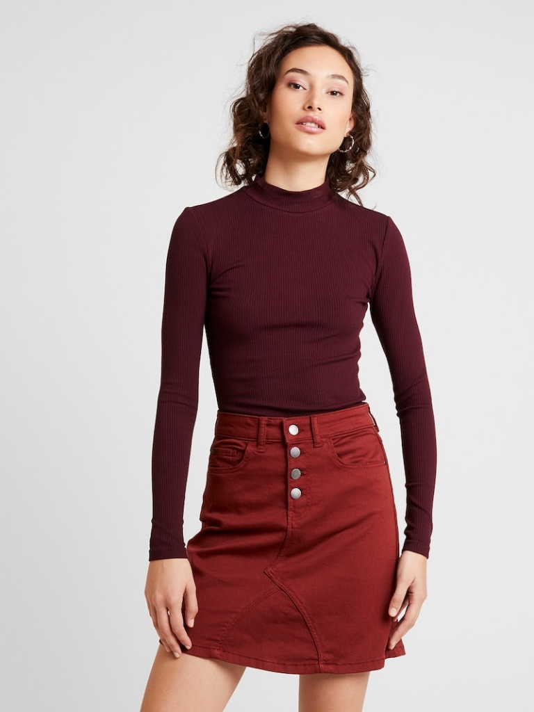

# VTry 👗🌟 *(Currently in Development)*

> 🚧 **AI-Powered Virtual Try-On System** — Instantly see how clothes look on you. Built using Deep Learning, Pose Estimation, and Image Segmentation.

---

## 💡 What is VTry?

**VTry** is a smart virtual wardrobe system that lets users upload a photo of themselves and a clothing item, and generates a realistic try-on output. Instead of imagining how something might look, users can now visualize it directly with the help of AI.

> Integrates OpenPose for pose detection, U-2-Net for segmentation, and VITON-HD for try-on generation.

---

## 🤖 Project Status

> ⚠️ This project is in **testing phase**. It's not deployed yet but works fully on local machines.

We are improving accuracy, optimizing processing time, and polishing UI/UX for eventual deployment.

---

## 🧵 Tech Stack

* **Backend**: Python, Flask
* **Frontend**: React.js, Tailwind CSS, Vite
* **Pose Estimation**: OpenPose
* **Cloth Segmentation**: U-2-Net
* **Image Synthesis**: VITON-HD

---

## 📁 Folder Structure

```
VTry/
├── frontend/             # React frontend UI
├── backend/              # Flask server + automation logic
├── automation/           # Cloth mask & pose detection logic
├── datasets/             # Test cloths, persons, pairs
├── results/              # Output folder (ignored)
├── environment.yml       # Conda environment setup
├── .gitignore            # Ignore heavy/model files
├── .gitattributes        # Git LFS tracking setup
└── README.md
```

> 🔹 Models and External Repositories are not included to reduce repo size.

---

## 📦 External Dependencies

Please manually download or clone the following before running the project:

### ✅ U-2-Net (Segmentation)

```bash
git clone https://github.com/xuebinqin/U-2-Net.git
```

Place it inside the root folder as:

```
VTry/U-2-Net/
```

### ✅ OpenPose

Follow official installation guide:
[https://github.com/CMU-Perceptual-Computing-Lab/openpose](https://github.com/CMU-Perceptual-Computing-Lab/openpose)

> ⚠️ Only binaries/models required for pose estimation need to be placed in `VTry/openpose/`

### ✅ VITON-HD Models (Try-On)

Download pre-trained models from:
[https://github.com/SXKDZ/VITON-HD](https://github.com/SXKDZ/VITON-HD)

Recommended to use only the final trained models. Place them in:

```
VTry/checkpoints/
```

---

## 🚀 Local Setup Guide

### 1. Clone Repo

```bash
git clone https://github.com/KARALKIRTI/VTry.git
cd VTry
```

### 2. Create and Activate Conda Environment

```bash
conda env create -f environment.yml
conda activate virtualWardrobe
```

### 3. Run Backend Server

```bash
cd backend
python app.py
```

### 4. Run Frontend App

```bash
cd frontend
npm install
npm run dev
```

Open: `http://localhost:5173`

---

## 📊 Features

* Upload a person image and a clothing image
* Detects human pose using OpenPose
* Generates cloth mask using SAM/U-2-Net
* Synthesizes final output using VITON-HD
* User-friendly UI to visualize results

---

## 📷 Sample Input → Output

<table>
  <tr>
    <th>Person Image</th>
    <th>Cloth Image</th>
    <th>Try-On Output</th>
  </tr>
  <tr>
    <td></td>
    <td></td>
    <td></td>
  </tr>
</table>

---

## 📊 Limitations

* Works best with front-facing, standing person images
* May misalign on occluded or unusual poses
* Dependent on OpenPose and segmentation quality

---

## 🔒 License

This project is under the [MIT License](LICENSE)

---

## 👏 Acknowledgements

* [VITON-HD](https://github.com/SXKDZ/VITON-HD)
* [OpenPose](https://github.com/CMU-Perceptual-Computing-Lab/openpose)
* [U-2-Net](https://github.com/xuebinqin/U-2-Net)

---

> 🌟 Developed with passion by KARALKIRTI — AI for fashion, reimagined.
